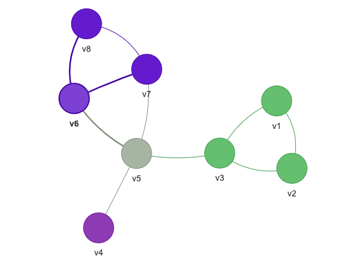
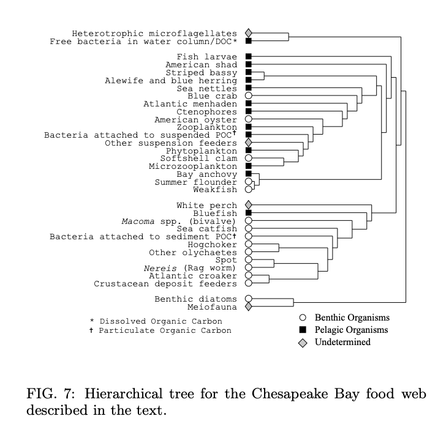

[](https://classroom.github.com/a/k4EuOu43)
# Community Detection on the Chesapeake Bay Food Web

**Learning Goals:** In this assignment, you will implement the Girvan-Newman algorithm for community detection, apply it to the Chesapeake Bay Food Web, and compare your results to those from the paper. This assignment addresses [learning objectives 2 and 3](https://reed-compbio-classes.github.io/bio331-F24-syllabus/doc/goals/):

- Implement graph algorithms and apply them to biological networks (including simulated and real-world datasets).
- Interpret the results of an algorithm run on a biological network.

**Criteria for Success:** There are five tasks in this assignment (Tasks A-E). 

:exclamation: The `pytests` and rubric are in progress. You will be notified when you should sync your assignment. 

At any point you can type `pytest` in the terminal to see how many of the tests pass. These tests are located in a file with `test_` as a prefix, so you can see which examples pass and fail and debug your program.

**Resources:** Refer to the [the Python Resources on Moodle](https://moodle.reed.edu/mod/page/view.php?id=300747) page or the [Bio131 Python Crashcourse](https://reed-compbio-classes.github.io/python-crashcourse/) for Python syntax refreshers.  [PythonTutor](http://pythontutor.com/) can also help you with interactive debugging.

## The Goal

Your goal is to implement the Girvan-Newman algorithm and visualize the Chesapeake Bay Food Web with different numbers of communities. The Girvan-Newman algorithm is from the paper [Community Structure in Social and Biological Networks](https://arxiv.org/pdf/cond-mat/0112110v1.pdf) (PNAS 2002).    

**For this assignment, all graphs are undirected and unweighted.**

:question: Have a question at any point? Ask Anna!  This assignment has many components, and there's a good chance that Anna can provide additional clarifications to the class.

:hammer: Functions labeled with :hammer: are written for you in `utils.py`. You can use these or you can choose to implement them on your own, if you want a challenge.

## :star: **Task A**: Overview & Preliminaries

### Girvan-Newman Overview: This divisive algorithm has the following steps:

1. Assign all nodes to a single cluster.
2. Calculate the _edge betweenness_ of all edges in the network.  
3. Remove the edge with the highest betweenness.
4. If removing the edge `(u,v)` means that `u` and `v` are no longer in the same connected component, replace the single cluster containing `u` and `v` with two clusters, one that contains `u` and one that contains `v`.
3. Repeat from Step 2 until no edges remain to remove.


The method you write should output a partition/grouping that increases the number of groups by one each time.

### Preliminaries: Read the Example Edge File

There are two graphs included in this homework: `files/example-edges.txt` contains the edges from the example above; start with this one. You will run your code on the Chesapeake Food Web after it works for the example. For now, write code to read `files/example-edges.txt` and return a node list, an edge list, and an adjacency list.

**By the end of the preliminaries, you should have a node list, and edge list, and an adjacency list of the graph.** This is a connected graph, so all nodes appear in the edgelist.


## :star: **Task B**: Implement Edge Betweenness OR Comment Existing Code

This function is broken down into the following pieces - read the whole task before beginning. 

:exclamation: If you are newer to programming, you have the option to get a solution to Task B and comment what each step does. Email me if you'd like to opt into this part. 

### B1. As a first step, solve the edge betweenness for _one_ edge.  

Write a `single_edge_betweenness()` function that takes four inputs: (a) the list or set of `nodes`, (b) the `paths` variable from step 1 above, (c) a node `u`, and (d) a node `v` and returns a float that represents the betweenness centrality of the edge `[u,v]`. The betweennes centrality _B(e)_ for an edge _e_ is calculated as the following:


where _sigma(s,t)_ is the number of shortest paths from _s_ to _t_ _sigma(s,t|e)_  is the number of shortest paths from _s_ to _t_ that go through edge _e_.  The sum includes all pairs of nodes _s_ and _t_ for which a path exists (that is why the sum is over all pairs _s_ and _t_ where _sigma(s,t)_ is at least one).

### B2. :hammer: You have code to compute all pairs shortest paths.

To calculate betweenness for an edge, you need to know all the shortest paths among all pairs of nodes in the graph. Code in `utils.py` includes a function to get the shortest paths of all pairs. Note that `import utils` is at the top of `run.py` - this allows you to call functions from the `utils.py` file like so:

```
paths = utils.all_pairs_shortest_paths(adj_list)
```

The function returns a _dictionary of dictionaries_, which allows you to get the shortest paths from any pair of nodes. To print the shortest paths from v5 to v8, for example, you would write

```
print(paths['v5']['v8'])
```

Note that the returned value is a _list of lists_ (in this case, `[['v5', 'v6', 'v8'], ['v5', 'v7', 'v8']]`). Each element in this list is a path, described by a list of nodes.  (yes, that's a _lot_ of lists!). To print _each path_ from v5 to v8, you could loop over `paths['v5']['v8']`:

```
for p in paths['v5']['v8']:
  print(p)
```

:question: Confused about what a variable contains? Print statements are your friends here! Try putting these lines in the `main()` function and observe what happens when you run the code. 

:bulb: Computing all-pairs shortest paths can take some time, but you only need to call it _once_ for each iteration.

### B3. Make sure you call your `single_edge_betweenness()` function to see what's going on as you work on it. 

You can test your function by putting the following code in `main()` (assuming you have a `nodes` variable that is a list/set of nodes):

```
paths = utils.all_pairs_shortest_paths(adj_list)
print(single_edge_betweenness(nodes,paths,'v3','v5')) # should be 15.0
print(single_edge_betweenness(nodes,paths,'v5','v7')) # should be 7.5
```

Betweenness calculations for edges `(v3,v5)` and `(v7,v8)` are shown below.

  &nbsp;&nbsp;&nbsp;&nbsp;&nbsp;&nbsp;&nbsp;&nbsp;&nbsp;&nbsp;&nbsp;&nbsp;&nbsp;&nbsp;&nbsp;&nbsp;    

### B4. Then, calculate edge betweenness for all edges in the graph.

Now, write an `edge_betweenness()` function that takes a node list/set, an edge list, and an adjacency list and returns a dictionary where the keys are edges and the values are the edge betweenness centrality. Within this function, you will call the `single_edge_betweenness()` function you wrote in B1.

:bulb: you might not need the edge list, but pass it in anyway; the pytests expect this. You will definitely need the adjacency list because that is what `utils.all_pairs_shortest_paths(adj_list)` takes as input.

The final betweenness dictionary will have _(e,B(e))_ key-value pairs. To store edges as _keys_ in a dictionary, use a tuple (e.g., `(u,v)` or `('v1','v2')`) rather than 2-element lists. (`[u,v]`). Note the parentheses instead of lists. Tuples can be indexed into just like lists:

```
edge = ('a','b')
print(edge[0])
print(edge[1])
```

The difference is that you cannot change the contents of a tuple, so they can be hashed as keys. (This is a minor detail, but it's helpful to know about if you're interested in this kind of thing).

### Expected Output

In the first iteration of the algorithm, the edge betweenness dictionary contains the following values:

```
#key        value
('v1', 'v2') 1.0
('v1', 'v3') 6.0
('v2', 'v3') 6.0
('v3', 'v5') 15.0
('v5', 'v6') 7.5
('v5', 'v7') 7.5
('v5', 'v4') 7.0
('v6', 'v8') 3.5
('v6', 'v7') 1.0
('v8', 'v7') 3.5
```

## :star: **Task C**: Implement the Girvan-Newman Algorithm

Now, write a `GN()` function that takes a node list/set, an edge list, and an adjacency list and returns a list of lists that describes all of the clusters at each step of the algortihm. Let's revisit the steps for the Girvan-Newman Algorithm:

### C1. Assign all nodes to a single cluster.

Create a `partitions` variable, which will be a list of lists.  Each element in `partitions` will be _one_ grouping.  This starts with all nodes in a single group. Initialize the `partitions` variable with the `nodes` list.

```
partitions = [[nodes]]
```

When you print `partitions` you will see a nested list like this:

```
[[['v1', 'v2', 'v3', 'v5', 'v6', 'v8', 'v7', 'v4']]]
```

Your `GN()` function will **return** the `partitions` variable after you've appended other clusterings to it.

### C2. Calculate the _edge betweenness_ of all edges in the network.  

You've done it! See Task B.

### C3. Remove the edge with the highest betweenness

You should get `(v3,v5)` on the first iteration of the algorithm. You need to remove this edge from the graph. 

:hammer: There are two functions in `utils.py` that will come in handy.  The first removes an edge from an edgelist, the second removes an edge from an adjacency list. Both of these functions change the data structures _in-place_, meaning that you don't need to assign them to new variables. Try running these examples to see what happens.

```
edgelist = [['a','b'],['b','c'],['d','a']]
utils.remove_from_edgelist(['a','b'],edgelist)
print(edgelist)
utils.remove_from_edgelist(['a','d'],edgelist)
print(edgelist)


adjlist = {'a':['b','c'],'b':['a','c','d'],'c':['a','b','c'],'d':['b']}
utils.remove_from_adjlist(['a','b'],adjlist)
print(adjlist)
utils.remove_from_adjlist(['d','b'],adjlist)
print(adjlist)
```

You need to remove the edge from _both_ the edge list and the adjacency list - keep these two data structures consistent.

### C4. If removing an edge divided a group, make a new partition.

:hammer: We need to determine if removing the edge splits a connected component into two pieces. For this, we will use a `utils.conncomp()` function that takes an adjacency list and a single node `u` and returns a sorted list of nodes that are in the same connected component as `u`. (It is modified from L4's `check_cycle()` function, in fact).

If removing the edge `(u,v)` means that `u` and `v` are no longer in the same connected component, replace the single cluster containing `u` and `v` with two clusters, one that contains `u` and one that contains `v`. Since the output of `conncomp()` is sorted, you can directly compare the connected component starting from `u` and the connected component starting from `v` using the equals sign (`==`).

:hammer: After you determine whether you should make a new partition, you can use the `utils.split_partition()` function. You will need the _previous partition_ (which can be accessed using `partitions[len(partitions)]`, or even cooler, `partitions[-1]`), the group that is will be split (a list or set of nodes), and the two splits (two lists or sets of nodes). The function returns the updated partition. Here's some example code to run:

```
prev_partition = [['a','b','c','d'],['e','f']] 
split1 = ['a','c']
split2 = ['b','d']
next_partition = utils.split_partition(prev_partition,split1,split2)
print(next_partition)
```

`next_partition` will then be:

```
[['e', 'f'], ['a', 'c'], ['b', 'd']]
```

### C5. Repeat from Step 2 until no edges remain to remove.

This will require a `while` loop, since you don't know when removing an edge results in a split. :question: What is the terminating condition?

### Return all partitions.

Note that `partitions` is a _single_ list, where each element of the list is a partition (or grouping) of _all_ the nodes.  One final partition might be the following (yours might be different):

```
[[['v1', 'v2', 'v3', 'v4', 'v5', 'v6', 'v7', 'v8']],
[['v1', 'v2', 'v3'], ['v4', 'v5', 'v6', 'v7', 'v8']],
[['v1', 'v2', 'v3'], ['v4'], ['v5', 'v6', 'v7', 'v8']],
[['v1', 'v2', 'v3'], ['v4'], ['v5'], ['v6', 'v7', 'v8']], # group at index 0 is separated in any order
[['v1', 'v2'], ['v3'], ['v4'], ['v5'], ['v6', 'v7', 'v8']],
[['v1'], ['v2'], ['v3'], ['v4'], ['v5'], ['v6', 'v7', 'v8']], # group at index 5 is separated in any order
[['v1'], ['v2'], ['v3'], ['v4'], ['v5'], ['v6'], ['v7', 'v8']],
[['v1'], ['v2'], ['v3'], ['v4'], ['v5'], ['v6'], ['v7'], ['v8']]]
```

**There are XXX tests for the `GN()` function.**

## :star: **Task D**: Putting it All Together

#### Post the Example Graph

All right! You can now post a graph to GraphSpace that colors the nodes by partition. Again, there is a `utils.py` function to help you. This function is just like previous functions, but it also takes a partition of nodes. If your `partitions` variable looks like the one above, then you can get a single partition by taking an element from `partitions` (e.g., `partitions[3]` will return the partition of 4 groups). If you have the `partitions` variable and the `edge_list` variable, you can call:

```
utils.viz_example(nodes, edge_list, partitions[3], 'example-4groups.html')
```



:exclamation: Ack! You might not have any edges appear!  That's because we _removed_ them during the algorithm! Since the `edge_list` and `adj_list` variables were modified in-place, they will be the leftovers after Girvan-Newman is done. Before calling `utils.viz_example()`, simply re-read the edges file to get new versions of the edge list and adjacency list. (There are other ways to handle this too).

#### Post the Chesapeake Bay Food Web

There are two files related to the Chesapeake Bay foodweb:
- `files/foodweb-edges.txt`: list of edges, where components have IDs.
- `files/foodweb-nodes.txt`: a three-column file of (a) component ID, (b) component name, and (c) component classification (Benthic, Pelagic, or Unknown).

The node file will be helpful for annotating your graph with node names and node shapes according to their classification.  

You are now ready to run the code on the Chesapeake Bay Food Web.
1. Read the foodweb edges and the foodweb nodes. :hammer: P2 will be helpful.
1. Run Girvan-Newman to generate all partitions.
2. Make a new `viz_foodweb()` function by copying `viz_example()` from the `utils.py` file and modifying it to annotate the node label according to the component name and the node shape according to their classification: 'Benthic','Pelagic', or 'Unknown'. This information comes from `files/foodweb-nodes.txt`.
3. Post the graph with the partition at index 3 (four groups, e.g., `partition[3]`).

## :star: **Task E**: Compare the Unweighted Clustering to the Paper Result

Your graph was generated using an unweighted graph that captures the highest-weight edges of the original Chesapeake Bay Food Web. Running the weighted version produced this result from the original paper by Girvan & Newman:



In the comments, write a short paragraph about the similarities and differences you observe in your network compared to the published result.

## Optional Challenge: Use the weighted food web!

There is one more file for you to work with - `files/foodweb-edges-weighted.txt` contains three columns: node1, node2, and weight. In order to run your code on a weighted network, you need to do the following two things:

1. Convert the edge weights, where higher is better, to edge _costs_. Typically, this is done by taking the negative log of the weight. You can add `import math.log` to the top of your file and then calculate the log of a number `x` by calling `math.log(x)`.


2. Implement Dijkstra's algorithm for calculating shortest paths on weighted networks. See the slides from 9/18 (Centralities lecture) to review how to implement Dijkstra's algorithm. :bulb: It is quite similar to the shortest_paths code in the utils file.

## Submitting

:star2: **You're Done with Tasks A-E!** Commit and push your changes so they appear in your repositories in the [Reed Compbio Classes GitHub organization](https://github.com/Reed-Compbio-Classes/).

**Resubmission Instructions:** According to Bio331's [deadline policy](https://reed-compbio-classes.github.io/bio331-F24-syllabus/doc/policies/#deadline-policy), you can resubmit any programming or written assignment if you follow these guidelines:

- You must submit whatever work you have by the deadline.
- You must include a comment or statement saying you will resubmit this assignment.
- You must schedule a time to meet with me within one week of the deadline in order to make a plan. 

This is intended to be used if you cannot complete the work by the deadline. If you make a major misstep on an assignment, I will reach out to talk about resubmission options. You must submit all work by 5pm on the last day of finals. 